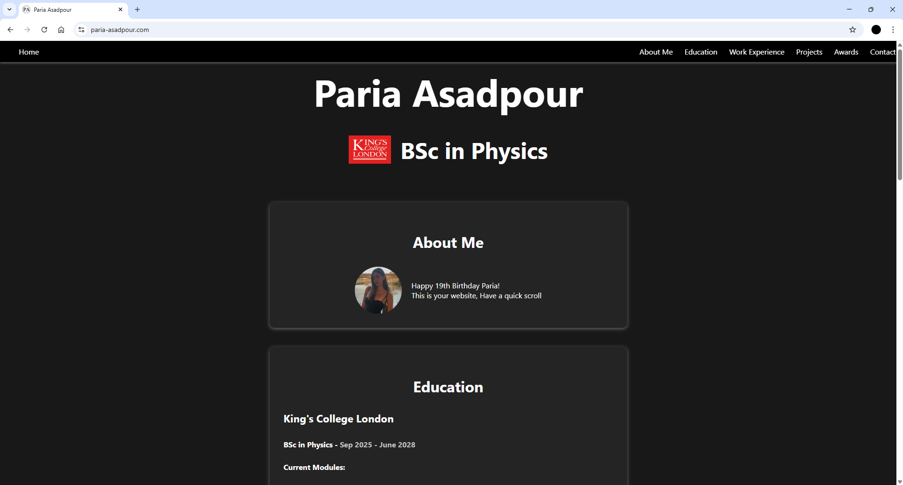

# Website Link
https://paria-asadpour.com

# About
Designed and deployed a responsive portfolio website using HTML5 and CSS3.
Showcases client's background, experience, and achievements in a professional format.

Includes:
- About Me section
- Education history
- Work experience
- Projects
- Awards
- Contact information (Embedded CV PDF viewer, LinkedIn redirect and Email contact functionality)

# Preview


# Deployment
Hosted via Netlify with a custom domain name acquired from FastHosts.

# Technologies
- HTML5
- CSS3
- Netlify Hosting & Deployment Service

# Features
- Mobile and Desktop Device Optimisation
- Responsive Design
- Professional and Intuitive User Interface


# Skills developed
- Optimised website creation using HTML and CSS
- Analysing client requirements and delivering them
- Hosting and deployment of websites 
- Deployment to GitHub


## Project Structure
```
/Project
 ├──Prototype1
 ├──Prototype2
 ├──Prototype3
 ├──Prototype4 (most recent)
    ├──index.html
    ├──style1.css
    ├──images.png
    ├──cv.pdf
```
